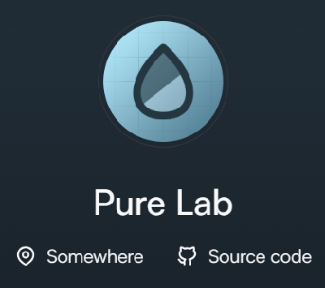

人类著名构史学家*JerryMin*曾经说过：

>这个Astro模板是我目前见过最舒适的模板了！

*JerryMin*对这个网页爱不释手，他不仅立flag说要频繁更新~~开始画饼~~，也希望给想要基于此模板进行客制化的各位提供一种方案~~又画一张~~，以及试图以最简单的方式，说明对原项目做了哪些更改以及更改的方式。

所以他就写了这样一段markdown作为参考，而我跟着他的教程，创建了此网站，遂将其搬运过来。

## 图片替换
### 网页图标替换
> 网页图标就是最上面那个图片，最初大概是这样的：
>
> 
>
> 我们的目标是变成这样：
>
> 
> 下面是简单的操作步骤。

下图为<strong>示例图标</strong>，用这个网站 [favicon.io](https://favicon.io) 将其转化为`.ico`文件：


你会得到一个`.zip`压缩包，解压后的一堆文件是这样：
```bash
android-chrome-192x192.png
android-chrome-512x512.png
apple-touch-icon.png
favicon-16x16.png
favicon-32x32.png
favicon.ico
site.webmanifest
```
直接原封不动的复制<del>（替换）</del>到目录即可：
```bash
./public/favicon
```

### 主页头像替换
主页头像的位置在：
```bash
./src/assets/avatar.png
```
直接用你保存好的图片替换即可，不过需要文件名和后缀相同，否则需要更改源码。

## 网站的基本信息更改
### site.config.ts更改
此文件直译过来是：**网站注册表**，个人理解为网站信息的注册地，`.ts`后缀代表用`typescript`编写。此文件在项目中的地址为：
```bash
./src/site.config.ts
```
利用`Ctrl + F`查找文件的一些关键字，这里一一列出，注释都已表明在源文件，这里不作展示：
- title 即网页的名字，如下图：


它们写在下列字段，你可以用你的眼睛一行一行搜索，但还是建议使用`Ctrl + F`查找：
```typescript
title: 'Astro Theme Pure'
title: 'JerryMain Island'
```

当然title的改变也会影响导航栏的改变，如下图左侧内容：


- author 即网页的所有者，如下图：

|  |  |
|:---:|:---:|
|  |  |

与上述同理，使用`Ctrl + F`查找下列字段并修改：

```typescript
author: 'Pure Lab'
author: 'JerryMain'
```

当然这里只说明了author的更改，至于定位、网页以及头像的更改可以跳转到[下文](#博客主页面mainpage更改)的第一部分。


- description 个人介绍，原文是乔布斯的名言，可以自行更改：
```typescript
description: 'Stay hungry, stay foolish'
description: 'Stay stupid, stay android'
```
- navigation 即导航栏，也就是下图右侧的内容：


你可以找到这样的字段进行更改，我个人删除了`Docs`官方说明文档：

```typescript
  header: {
    menu: [
      { title: 'Blog', link: '/blog' },
      //docs是官方说明文档，可以有选择性的删除此行
      { title: 'Docs', link: '/docs' },   
      { title: 'Projects', link: '/projects' },
      { title: 'Links', link: '/links' },
      { title: 'About', link: '/about' }
    ]
  }
```
- ICP 即网络内容服务商，按照相关要求进行填写即可，它的显示位置在页脚左侧：


```typescript
title: 'Moe ICP 114514'
title: 'Your ICP'
```
- GitHub Page 即页脚指向的仓库，位置在上图右侧，可通过以下字段查询：
```typescript
social: [
  { icon: 'github', label: 'GitHub', href: 'https://github.com/cworld1/astro-theme-pure' },
  { icon: 'rss', label: 'RSS', href: '/rss.xml' }
]
```
对于这条代码的处理方法稍有不同，各位可酌情借鉴，这里不作展开：
```typescript
social: { github: 'https://github.com/JerryMain521/website' }
```
- Link 即你网站的主页地址：
```typescript
name: 'Link', val: 'https://astro-pure.js.org/'
name: 'Link', val: 'https://jerrymain.top/'
```
- Avatar 就是显示在页面上的头像图片，它直接引用了你网站`/favicon/`目录下的图标文件作为头像，我们直接替换前面的网址就可以：
```typescript
name: 'Avatar', val: 'https://astro-pure.js.org/favicon/favicon.ico' 
name: 'Avatar', val: 'https://jerrymain.top/favicon/favicon.ico' 
```

### 博客主页面（MainPage）更改


这是我们一进来的界面，这个界面就是主页面。前面只介绍了部分细节的更改，这里做全部的解释。

你需要在这个路径中找到MainPage的源代码：

```bash
./src/pages/index.astro
```

- 地址和个人GitHub网页地址的更改

在前面我们已经讲过了关于`author`的更改，这里再放出对比图，下面就是要换地址和仓库：

|  |  |
|:---:|:---:|
|  |  |

这里是地址，搜索到此字段后，可以将`Somewhere`改成你想改的地址：
```typescript
<Label title='Somewhere'>
```

这里是你的GitHub仓库地址，搜到后可以将`title`和`href`字段改成你的信息：
```typescript
<Label
  title='Source code'                                 //here
  as='a'
  href='https://github.com/cworld1/astro-theme-pure'  //here
  target='_blank'
>
```

### about的index.astro
文件地址为：
```bash
./src/pages/about/index.astro
```
下面拆解这个文件的内容，当然如果你能看懂HTML的话就变得极其简单：
```astro
  <p>Developer / Designer</p>
  <p>
    Lorem ipsum dolor sit amet, vidit suscipit at mei. Quem denique mea id. Usu ei regione indoctum
    dissentiunt, cu meliore fuisset mei, vel quod voluptua ne. Ex dicat impedit mel, at eum oratio
    possit voluptatum.
  </p>
  <p>
    Motto: Stay hungry, Stay foolish. <Spoiler>这里可以夹私货，比如为什么要演奏春日影！</Spoiler>
  </p>
```
```astro
  <Button title='Sponsor Me' class='w-fit' href='/projects#sponsorship' variant='ahead' />
```
```astro
  {/* general-talk */}
  <h2 id='hobbies'>Hobbies</h2>
  <ul>
    <li>Lorem ipsum dolor sit amet, vidit suscipit at mei.</li>
    <li>
      Quem denique mea id. Usu ei regione indoctum dissentiunt, cu meliore fuisset mei, vel quod
      voluptua ne.
    </li>
    <li>Ex dicat impedit mel, at eum oratio possit voluptatum.</li>
    <li>Impetus fuisset ullamcorper pri cu, his posse iisque ad, aliquam honestatis usu id.</li>
  </ul>
```
```astro
  <ToolSection
    class='mb-5'
    title='Design'
    tools={[
      {
        name: 'Photoshop',
        description: 'Picture Editing',
        href: 'https://www.adobe.com/products/photoshop',
        icon: import('@/assets/tools/photoshop.svg?raw')
      }
    ]}
     ...
  />
```
```astro
  {/* social-networks */}
  <h2 id='social-networks'>Social Networks</h2>
  <p>
    Lorem ipsum dolor sit amet, vidit suscipit at mei. Quem denique mea id. Usu ei regione indoctum
    dissentiunt, cu meliore fuisset mei, vel quod voluptua ne.
  </p>
```
```astro
  <Substats
    stats={[
      {
        platform: 'GitHub',
        icon: 'github',
        link: 'https://github.com/cworld1',
        text: 'followers',
        api: 'github/cworld1'
      }
    ]}
    ...
  />
```
```astro
  {/* gossips */}
  <h2 id='gossips'>Gossips</h2>
  <Collapse title='Lorem ipsum'>
    Lorem ipsum dolor sit amet, vidit suscipit at mei. Quem denique mea id. Usu ei regione indoctum
    dissentiunt, cu meliore fuisset mei, vel quod voluptua ne. Ex dicat impedit mel, at eum oratio
    possit voluptatum.
  </Collapse>
```
```astro
  <Timeline
    events={[
      {
        date: '2024-04-29',
        content:
          'Website refactored using <a href="https://astro.build/" target="_blank">Astro</a> and <a href="https://github.com/srleom/astro-theme-resume" target="_blank">Astro Theme Resume</a>'
      }
    ]}
    ...
  />
```
```astro
  <p>
    The smooth operation and personalized customization of website also rely on the resources and
    technical support provided by the following excellent projects/service providers:
  </p>
```
```astro
    <li>
      Domain: <a href='#' target='_blank'>Vercel</a>
    </li>
```

### links的index.astro
文件地址为：
```bash
./src/pages/links/index.astro
```

### projects的index.astro
文件地址为：
```bash
./src/pages/projects/index.astro
```