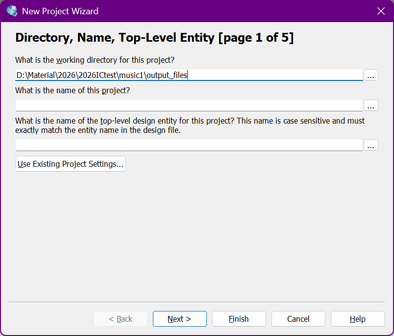
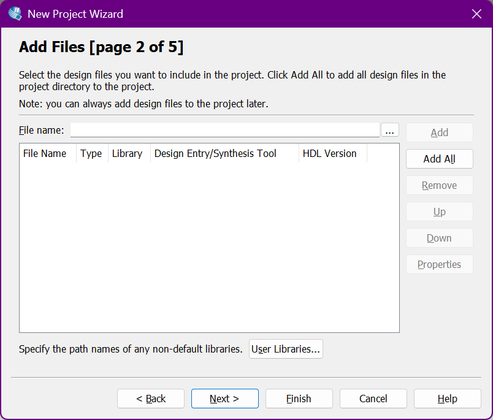
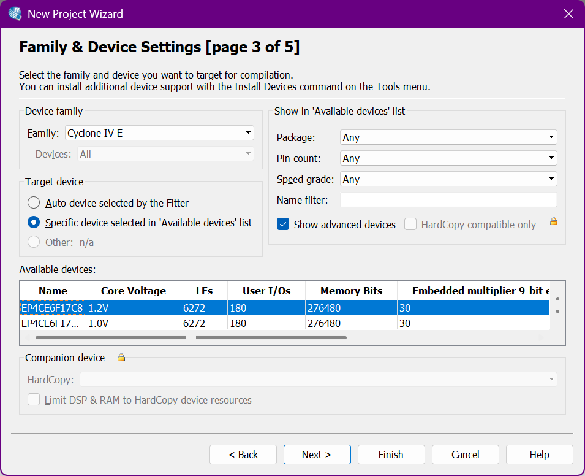
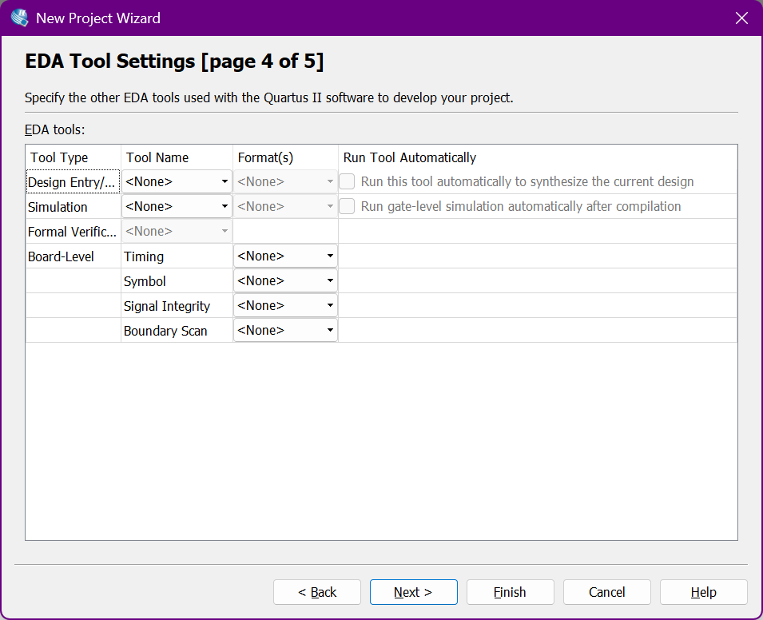
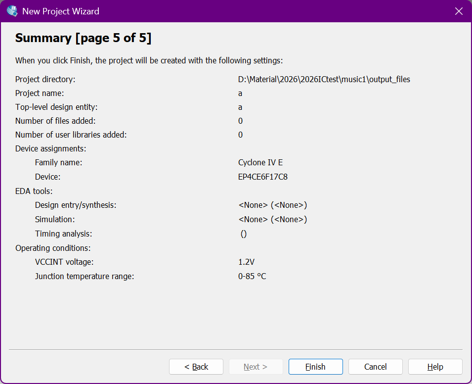
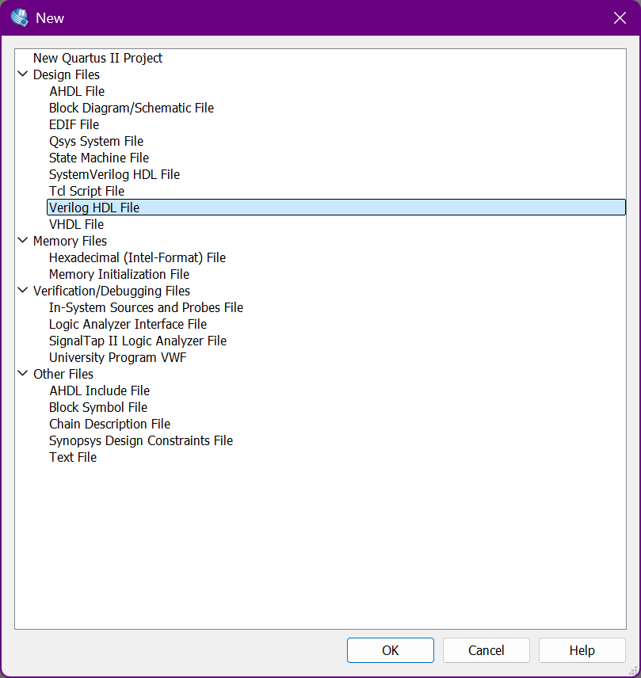
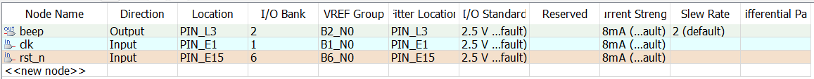
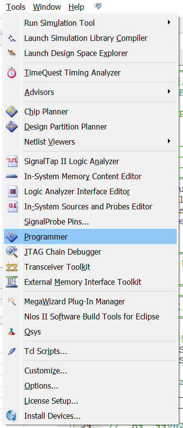
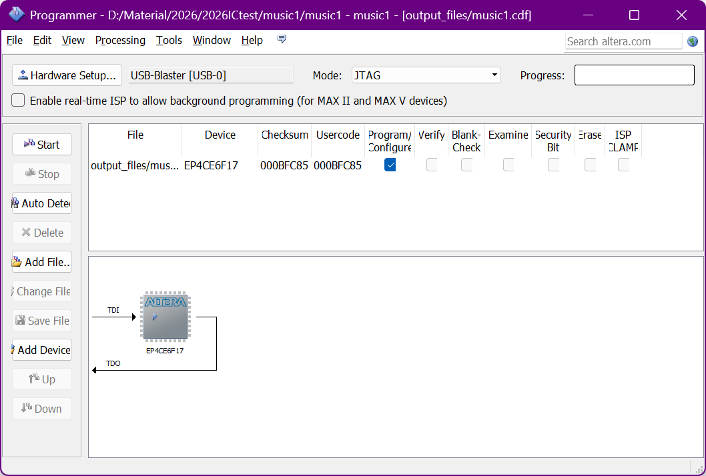

## 成品
老蒋大战僵尸，不多说了，请看视频。

<iframe 
  src="https://player.bilibili.com/player.html?bvid=BV1dwojBLEvD&autoplay=0"
  width="100%" 
  height="500"
  scrolling="no" 
  frameborder="no" 
  allowfullscreen>
</iframe>

## 过程
### 使用器材
- 软件：MuseScore Studio 4, Quartus II 13.0 sp1 
- 硬件：Cyclone IV EP4CE6F17C8N（学校发的数电板子）
### 构建过程
1. 新建`New Project Wizard`
2. 填入信息：第一栏填项目地址，一般是个空文件夹；第二栏填项目名字，第三栏会自动复写第二栏的名字。



3. 这一页不动。



4. 填入芯片信息：`Family:Cyclone IV E`和`EP4CE6F17C8`。



5. 这一页不动。



6. 直接点Finish。



7. `Ctrl + N`新建`Verilog HDL File`文件。



8. 复制下列代码进入：

```verilog
// =====================================================
//  植物大战僵尸主题曲 - 小节 20~28 高音部
//  开发板 : EP4CE6F17C8N    时钟 : 50MHz
//  BPM    : 125             占空比 : 30%
//  蜂鸣器 : PNP 三极管驱动，低电平响
//
//  引脚分配:
//    clk   -> PIN_E1
//    rst_n -> PIN_E15
//    beep  -> PIN_L3
// =====================================================
module pvz_buzzer (
    input  clk,       // 50MHz
    input  rst_n,     // 复位，低电平有效
    output reg beep   // 蜂鸣器，低电平响
);

// =====================================================
//  音符参数：每个音符存高电平时长和低电平时长
//  计算公式：
//    高电平 = 50_000_000 / 频率 * 0.30
//    低电平 = 50_000_000 / 频率 * 0.70
//  修改占空比只需改这里的数值
// =====================================================

//  休止符（特殊标记，用最大值表示）
parameter REST_H = 32'hFFFFFFFF;
parameter REST_L = 32'd0;

//  G4  392Hz
parameter G4_H = 32'd38265;
parameter G4_L = 32'd89285;

//  A4  440Hz
parameter A4_H = 32'd34090;
parameter A4_L = 32'd79545;

//  B4  494Hz
parameter B4_H = 32'd30364;
parameter B4_L = 32'd70850;

//  C5  523Hz
parameter C5_H = 32'd28680;
parameter C5_L = 32'd66921;

//  D5  587Hz
parameter D5_H = 32'd25553;
parameter D5_L = 32'd59625;

//  E5  659Hz
parameter E5_H = 32'd22761;
parameter E5_L = 32'd53110;

//  G5  784Hz
parameter G5_H = 32'd19132;
parameter G5_L = 32'd44642;

//  A5  880Hz
parameter A5_H = 32'd17045;
parameter A5_L = 32'd39772;

//  B5  988Hz
parameter B5_H = 32'd15182;
parameter B5_L = 32'd35425;

//  C6  1047Hz
parameter C6_H = 32'd14326;
parameter C6_L = 32'd33428;

// =====================================================
//  节拍时长（BPM=125，四分音符 = 60/125*50M = 24,000,000）
//  修改 BPM 只需改 QUARTER，其余自动对应
// =====================================================
parameter QUARTER  = 32'd24_000_000;   // 四分音符
parameter EIGHTH   = 32'd12_000_000;   // 八分音符
parameter HALF     = 32'd48_000_000;   // 二分音符
parameter HALF_DOT = 32'd72_000_000;   // 附点二分音符

// =====================================================
//  音符序列，共 43 个音符
//  每行：[高电平计数, 低电平计数, 时长]
// =====================================================
parameter NOTE_TOTAL = 7'd43;

reg [31:0] seq_h   [0:42];   // 高电平计数
reg [31:0] seq_l   [0:42];   // 低电平计数
reg [31:0] seq_dur [0:42];   // 音符时长

initial begin
    //  小节 20
    seq_h[0]=A4_H;   seq_l[0]=A4_L;   seq_dur[0]=HALF;
    seq_h[1]=REST_H; seq_l[1]=REST_L; seq_dur[1]=QUARTER;
    seq_h[2]=E5_H;   seq_l[2]=E5_L;   seq_dur[2]=EIGHTH;
    seq_h[3]=G5_H;   seq_l[3]=G5_L;   seq_dur[3]=EIGHTH;
    //  小节 21
    seq_h[4]=A5_H;   seq_l[4]=A5_L;   seq_dur[4]=QUARTER;
    seq_h[5]=A5_H;   seq_l[5]=A5_L;   seq_dur[5]=EIGHTH;
    seq_h[6]=A5_H;   seq_l[6]=A5_L;   seq_dur[6]=EIGHTH;
    seq_h[7]=G5_H;   seq_l[7]=G5_L;   seq_dur[7]=QUARTER;
    seq_h[8]=E5_H;   seq_l[8]=E5_L;   seq_dur[8]=EIGHTH;
    seq_h[9]=D5_H;   seq_l[9]=D5_L;   seq_dur[9]=EIGHTH;
    //  小节 22
    seq_h[10]=E5_H;  seq_l[10]=E5_L;  seq_dur[10]=QUARTER;
    seq_h[11]=G5_H;  seq_l[11]=G5_L;  seq_dur[11]=EIGHTH;
    seq_h[12]=E5_H;  seq_l[12]=E5_L;  seq_dur[12]=EIGHTH;
    seq_h[13]=D5_H;  seq_l[13]=D5_L;  seq_dur[13]=HALF;
    //  小节 23
    seq_h[14]=E5_H;  seq_l[14]=E5_L;  seq_dur[14]=QUARTER;
    seq_h[15]=E5_H;  seq_l[15]=E5_L;  seq_dur[15]=QUARTER;
    seq_h[16]=D5_H;  seq_l[16]=D5_L;  seq_dur[16]=EIGHTH;
    seq_h[17]=E5_H;  seq_l[17]=E5_L;  seq_dur[17]=EIGHTH;
    seq_h[18]=D5_H;  seq_l[18]=D5_L;  seq_dur[18]=EIGHTH;
    seq_h[19]=C5_H;  seq_l[19]=C5_L;  seq_dur[19]=EIGHTH;
    //  小节 24
    seq_h[20]=A4_H;  seq_l[20]=A4_L;  seq_dur[20]=QUARTER;
    seq_h[21]=G4_H;  seq_l[21]=G4_L;  seq_dur[21]=EIGHTH;
    seq_h[22]=B4_H;  seq_l[22]=B4_L;  seq_dur[22]=EIGHTH;
    seq_h[23]=A4_H;  seq_l[23]=A4_L;  seq_dur[23]=QUARTER;
    seq_h[24]=A4_H;  seq_l[24]=A4_L;  seq_dur[24]=EIGHTH;
    seq_h[25]=C5_H;  seq_l[25]=C5_L;  seq_dur[25]=EIGHTH;
    //  小节 25
    seq_h[26]=D5_H;  seq_l[26]=D5_L;  seq_dur[26]=QUARTER;
    seq_h[27]=A4_H;  seq_l[27]=A4_L;  seq_dur[27]=EIGHTH;
    seq_h[28]=C5_H;  seq_l[28]=C5_L;  seq_dur[28]=EIGHTH;
    seq_h[29]=D5_H;  seq_l[29]=D5_L;  seq_dur[29]=QUARTER;
    seq_h[30]=D5_H;  seq_l[30]=D5_L;  seq_dur[30]=EIGHTH;
    seq_h[31]=E5_H;  seq_l[31]=E5_L;  seq_dur[31]=EIGHTH;
    //  小节 26
    seq_h[32]=G5_H;  seq_l[32]=G5_L;  seq_dur[32]=HALF_DOT;
    seq_h[33]=E5_H;  seq_l[33]=E5_L;  seq_dur[33]=EIGHTH;
    seq_h[34]=G5_H;  seq_l[34]=G5_L;  seq_dur[34]=EIGHTH;
    //  小节 27
    seq_h[35]=A5_H;  seq_l[35]=A5_L;  seq_dur[35]=QUARTER;
    seq_h[36]=C6_H;  seq_l[36]=C6_L;  seq_dur[36]=QUARTER;
    seq_h[37]=B5_H;  seq_l[37]=B5_L;  seq_dur[37]=EIGHTH;
    seq_h[38]=A5_H;  seq_l[38]=A5_L;  seq_dur[38]=EIGHTH;
    seq_h[39]=G5_H;  seq_l[39]=G5_L;  seq_dur[39]=QUARTER;
    //  小节 28
    seq_h[40]=A5_H;  seq_l[40]=A5_L;  seq_dur[40]=QUARTER;
    seq_h[41]=REST_H; seq_l[41]=REST_L; seq_dur[41]=QUARTER;
    seq_h[42]=REST_H; seq_l[42]=REST_L; seq_dur[42]=HALF;
end

// =====================================================
//  播放状态机
//  state=0 : 输出高电平阶段
//  state=1 : 输出低电平阶段
// =====================================================
reg [6:0]  note_idx;   // 当前音符索引
reg [31:0] dur_cnt;    // 音符时长计数器
reg [31:0] wave_cnt;   // 波形计数器（高/低电平）
reg        state;      // 0=高电平 1=低电平

always @(posedge clk or negedge rst_n) begin
    if (!rst_n) begin
        note_idx <= 7'd0;
        dur_cnt  <= 32'd0;
        wave_cnt <= 32'd0;
        state    <= 1'b0;
        beep     <= 1'b1;
    end else begin

        // ---- 音符时长：到期就切换到下一个音符 ----
        if (dur_cnt >= seq_dur[note_idx] - 1) begin
            dur_cnt  <= 32'd0;
            wave_cnt <= 32'd0;
            state    <= 1'b0;
            beep     <= 1'b1;   // 音符间隙拉高，避免连音粘连
            if (note_idx < NOTE_TOTAL - 1)
                note_idx <= note_idx + 7'd1;
            else
                note_idx <= 7'd0;   // 循环播放
        end else begin
            dur_cnt <= dur_cnt + 1;

            // ---- 休止符：保持高电平（不响） ----
            if (seq_h[note_idx] == REST_H) begin
                beep <= 1'b1;

            // ---- 普通音符：产生占空比 30% 的方波 ----
            end else begin
                case (state)
                    1'b0: begin  // 高电平阶段
                        beep <= 1'b0;   // PNP低电平响
                        if (wave_cnt >= seq_h[note_idx] - 1) begin
                            wave_cnt <= 32'd0;
                            state    <= 1'b1;
                        end else begin
                            wave_cnt <= wave_cnt + 1;
                        end
                    end
                    1'b1: begin  // 低电平阶段
                        beep <= 1'b1;
                        if (wave_cnt >= seq_l[note_idx] - 1) begin
                            wave_cnt <= 32'd0;
                            state    <= 1'b0;
                        end else begin
                            wave_cnt <= wave_cnt + 1;
                        end
                    end
                endcase
            end
        end
    end
end

endmodule
```

9. 保存文件，这里的`module`是`pvz_buzzer`，所以保存为`pvz_buzzer`。
10. 进行`Start Analysis & Synthesis`。


11. 使用快捷键`Ctrl + Shift + N`，进入`Pin Planner`配置引脚。



12. 点击`Start Compilation`


13. 编译完成之后进入`Tools -> Programmer`进行烧录。



14. 点击`Start`，等待`Progress`变绿即可。

