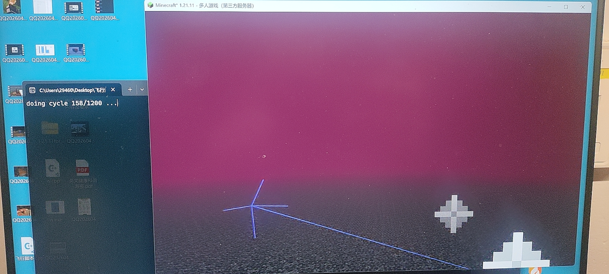

## 2026.4.22
这是堂吉诃德雕像重建，屏幕中的是CatHateStudying：

# 补档
> 著名构思学家JerryMain曾回忆道
> 
> 这里都是古老的回忆了。细细整理来，高考结束的暑假开了一个互通服务器，但是内容早已忘却，也没有什么留存；大一寒假开了第二个服务器，印象中有CatHatStudy搭的红石滚动显示屏，还有MYSBF留下的小构思高塔，不知道现在有没有了，留存的东西较多，不一一展开；大一暑假开了第三个服务器，是个三角洲河岸，看到了anchor搭的小村民房子和养的几只乐魂，虽然房子后来着火了，还有_chest_搭的菲圣索亚大白房子，里面有个没有鱼的鱼缸，还有两个BYD在天上玩儿空岛生存去了，我搞了点儿赤石科技，这里解释一下，赤石是因为真的炸过膛；同期还有第四个服务器，加入了一堆模组，出生点在雨林的湖中央，有宇姐造的雨林小房子，后来这个出生点还有一堆出生在雨林打枪；最近第五个服务器是Cat用整合包搭建的，依稀记得想给猫娘接本地API的Cat和被掏空的猴面包树，还有一个出生天天偷我锅盖，导致我想做饭都做不了。

图中是爱学习的小帽咪（CatHatStudying）在自动巡航：

